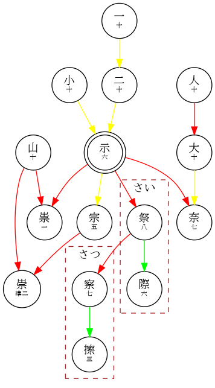

# KanjiNet

## Derivation Rules

### 普段の規則

- 一画を加える：一 → 十。日 → 白。天 → 矢
- 一画を変える：目 → 且。羊+大 → 美
- 親を繰り返す：口 → 品
- 字ではない片や冠を加える：合 → 拾う、荅
- 片が字であるが親とせず加える：且 → 粗、組
  - 例外：片に見える物が実は音符：甲 → 鴨。屯 → 頓
- 複数の字をそのまま組み合わせる：亡+心 → 忘。木+且 → 査

### やや珍しい継承方

- 歴史的な変体を許す：泉 → 原（親が「白+小」ではなくそのまま泉）
- 親が分解する：衣 → 哀、裏
- 共通する形が打てる字ではなく似た字を代表として選ぶ：
  - 「生族」：青、麦
  - 「首族」：道、夏（頁は貝からなるとされる）
  - 「鳥族」：島、烏、梟

## Kanji with unhelpful 部首

- 垂 → 土
- 年 → 干
- 束 → 木

## Areas of Exploration

- 「气」と「監」のあの”二みたいな部分”

## Resources

- https://www.aozora.gr.jp/kanji_table/touyoukanji_jitaihyou/
